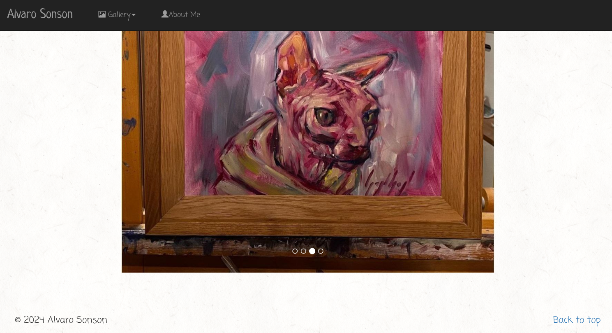
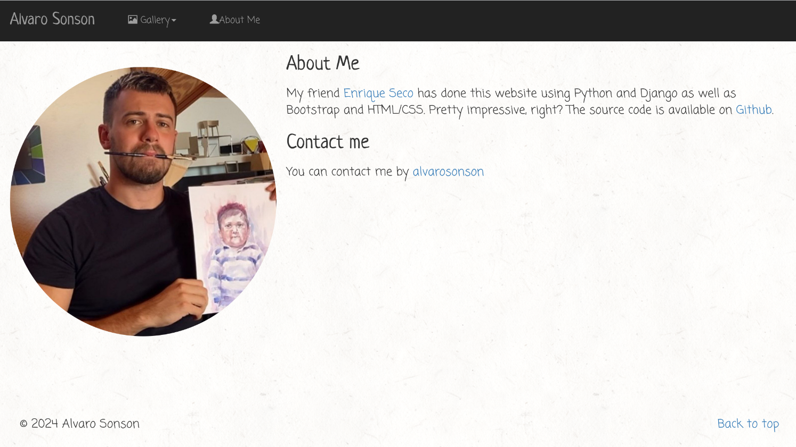

# Art Portfolio

## Overview
This project is a Django-based web application designed to showcase my friend's [Alvaro Sonson](https://www.instagram.com/alvarosonson) 
artwork in a visually appealing and user-friendly way. This app provides a platform to display artwork, 
share an artist's story, and engage with audiences online.



*Main screen showing the artwork gallery.*


---

## Features
- **Artwork Gallery**: Displays all uploaded artwork in a grid layout.
- **About Me Page**: Shares details about the artist and their creative journey.
- **Responsive Design**: Optimized for desktop, tablet, and mobile devices.
- **Contact Form**: (Optional) Allows visitors to reach out directly to the artist.

---

## Technology Stack
- **Backend**: Django (Python)
- **Frontend**: HTML, CSS, JavaScript
- **Database**: SQLite (default), with options for PostgreSQL or MySQL
- **Hosting**: Easily deployable on platforms like Heroku or AWS



*About Me page highlighting the artist's story.*

---

## Installation

Follow these steps to set up the project on your local machine:

1. **Clone the repository**:
   ```bash
   git clone https://github.com/enriqueseor/art-portfolio.git
   cd art-portfolio

2. **Run the web application on your local machine**:
    ``bash
    python manage.py runserver